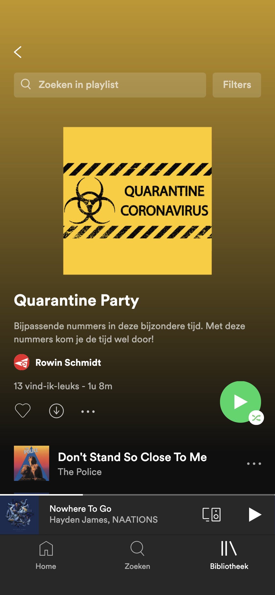
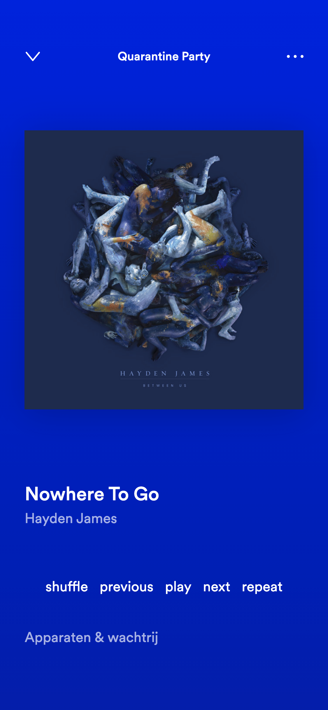
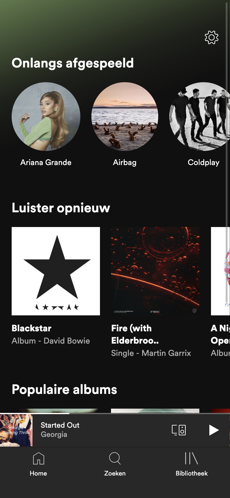
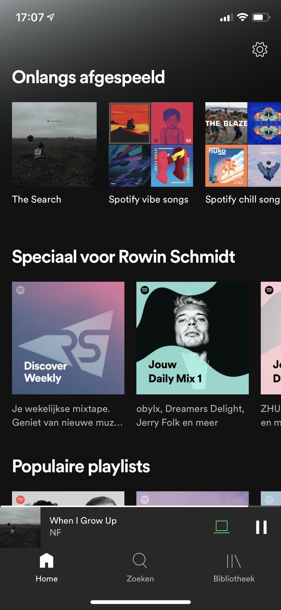
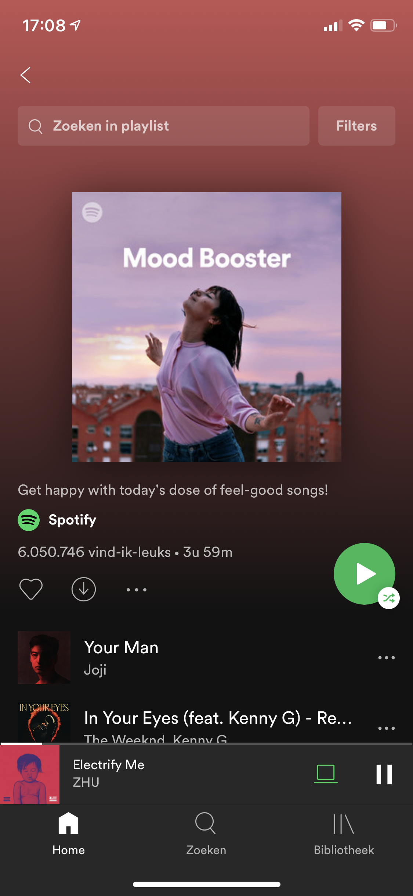

# Procesverslag
**Auteur:** Rowin Schmidt

Markdown cheat cheet: [Hulp bij het schrijven van Markdown](https://github.com/adam-p/markdown-here/wiki/Markdown-Cheatsheet). Nb. de standaardstructuur en de spartaanse opmaak zijn helemaal prima. Het gaat om de inhoud van je procesverslag. Besteedt de tijd voor pracht en praal aan je website.

## Bronnenlijst
1. https://developer.mozilla.org/en-US/docs/Learn/HTML/Multimedia_and_embedding/Video_and_audio_content
2. https://www.w3schools.com/css/css3_variables.asp
3. https://webdesign.tutsplus.com/tutorials/simple-fade-effect-on-scroll--cms-35166
4. https://www.geeksforgeeks.org/create-a-music-player-using-javascript/
5. https://stackoverflow.com/questions/14636536/how-to-check-if-a-variable-is-an-integer-in-javascript
6. https://stackoverflow.com/questions/33760520/get-data-attributes-in-javascript-code
7. https://stackoverflow.com/questions/68165/javascript-to-scroll-long-page-to-div
8. https://developer.mozilla.org/en-US/docs/Web/API/Document/keydown_event

## Eindgesprek (week 7/8)

-dit ging goed & dit was lastig-

**Screenshot(s):**

-screenshot(s) van je eindresultaat-

## Voortgang 3 (week 6)

### Stand van zaken
De afgelopen week ben ik voornamelijk bezig geweest met het maken van de playlist pagina. Deze pagina is de tweede van mijn website. Ik heb ervoor gekozen om een fictieve playlist te maken die erg actueel is (corona) met wat humor. Voor nu is deze afspeellijst nog statisch, maar ik wil proberen om dit via JavaScript werkend te maken (nummers aan kunnen klikken, etc.). 

Ook ben ik bezig geweest met het maken van een muziek speler. Ik had al het een en ander voor elkaar gekregen (zonder bronnen), maar kwam er niet helemaal meer uit. Ik heb dus op internet gezocht naar "plain JavaScript Music Player" en ben toen op een erg goede bron terecht gekomen. Deze bron ga ik gebruiken als basis voor mijn muziek speler (zie bronvermelding).

## Voortgang 2 (week 5)

### Stand van zaken
De periode tussen week 1 en week 3 verliep erg goed zonder echte problemen. Ik heb mij in deze periode wat meer gefocust op functionaliteiten toevoegen in plaats van nieuwe pagina's maken/bewerken. Ik heb zo met JavaScript een overlay functie gemaakt, om de albums te kunnen weergeven als een overlay. Daarnaast heb ik ook de header (home) werkend gemaakt d.mv.v. JavaScript en nog een aantal kleine dingen gewijzigd. Ik ben ook begonnen met het opzetten van de playlist pagina.

## Voortgang 1 (week 3)

### Stand van zaken
De afgelopen weken verliepen over het algemeen erg soepel zonder grote obstakels. Ik heb de eersta pagina in de basis al af, maar wil deze voor de aankomende periode nog verder uitbreiden. Waar ik een klein beetje ben vastgelopen is op het werkend maken van de progressie balk van het huidige nummer. Ik heb echter nu een goede site gevonden waar dit wordt uitgelegd en is het een kwestie van goed implementeren. Ik heb er vertrouwen in dat dit uiteindelijk wel goed gaat komen :D.

**Screenshot(s):**
Zoals hieronder te zien heb ik de Spotify app (ios) nagemaakt in HTML/CSS/JS. Ik vind het tot nu toe best goed gelukt, maar ga nog mogelijk maken dat je op het nummer kan klikken er een overlay zichtbaar wordt. Daarnaast moet er nog een andere pagina worden uitgewerkt, dat wordt een afspeellijst.

### Agenda voor meeting

-samen met je groepje opstellen-

| student 1      | student 2          | student 3    | student 4        |
| ---            | ---                | ---          | ---              |
| dit bespreken  | en dit             | en ik dit    | en dan ik dat    |
| an dat ook nog | dit als er tijd is | nog een punt | dit wil ik zeker |
| ...            | ...                | ...          | ...              |

### Verslag van meeting

-na afloop snel uitkomsten vastleggen-

## Breakdownschets (week 1)

## Intake (week 1)

**Je startniveau:** Zwarte piste.

**Je focus:** Beide punten: volledig responsive maken & extra aandacht voor de surface laag + extra's.

**Je opdracht:** De Spotify app namaken in HTML/CSS/JS. Bij voorkeur de native versie van de Spotify app (iPhone, iPad, Mac), maar als dat niet mag de desbetreffende webversie: https://open.spotify.com/ 

**Screenshot(s) van de eerste pagina (small screen):**

**Screenshot(s) van de tweede pagina (small screen):**

